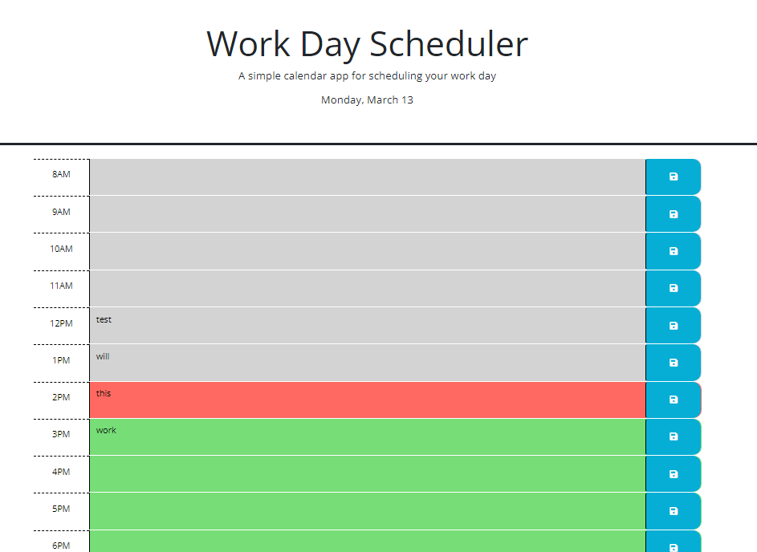

# 5-weekly-challenge
Week 5 Challenge - Work Day Scheduler

## Description

This repository contains the files for a work day scheduler. Using JavaScript, Jquery, Bootstrap, and dayJS, a day planner is created and displayed. The rows for the hours allow the user to input their tasks and save them to localStorage. The color of the rows change dynamically based on whether the time/task is in the past, present, or future. 

## Usage

https://joaqsala.github.io/5-weekly-challenge/

This webpage contains a workday planner with todays date displayed at the top. The user can add and save tasks to the planner to save for later or to see on another device. With past events shown in grey, the present shown in red, and the future shown in green, the user will have an easy time keeping up the day's to-do list.

## Credits

To my University of Texas Bootcamp Cohort, the course TA's and instructor, and other tutors who helped guide me. 

## License

Please refer to LICENSE in repo.